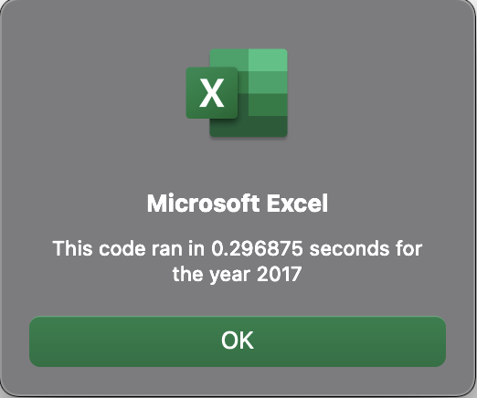

# stock-analysis
Module 2: Stock Analysis

## Overview of Project
Using the stock data for various ticker symbols for 2017 and 2018, we developed a subroutine to automate the process of calculating the percent of return. The automated process prompts the user to enter the year for the data they want to evaluate. The analyzed data is color coded green (positive return) or red (negative return). We also created a message box that informs the user the length of time used to complete the analysis. 

## Results
- Based on the analysis, the stocks from 2017 have an overall positive return rate. With the exception of the `RUN` ticker, all other stocks performed higher during 2017.
- There was a change in the `TERP` stock when comparing the return rate of 2017 and 2018. However, it is not statistically significant and it was negative for both years.

	

- The use of the refactoring code provided the same results at a significantly higher speed.

| | Original | Refactored |
| :--: | :--: | :--: |
| 2017 |  |  |
| 2018 |  |  |

 

## Summary
#### What are the advantages or disadvantages of refactoring code?

##### Advantages:
  - Opportunity to make more efficient. An execution timer allows us to compare two or more version of the code.
  - Provides an opportunity to learn from someone else's code and gain additional experience. 

##### Disadvantages:	
  - Requires additional time and resources.
  - Other bugs may be introduced.
	

#### How do these pros and cons apply to refactoring the original VBA script?
  - I was able to make the script more efficient. 
  - I learned the performance benefits of removing inner loops.
  - I spent an extra day refactoring and comparing the scripts.
  - Without tests, I can't be confident that new bugs were not introduced.
 